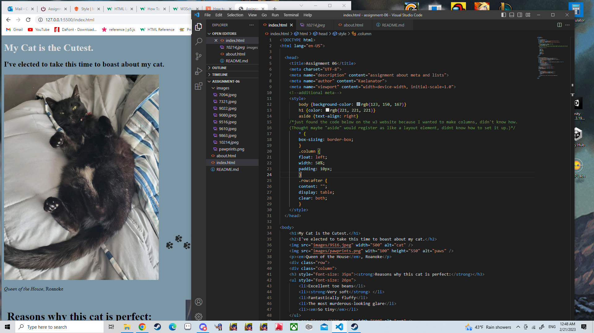

Difference between Semantic and Structural Markup:

Stuctural markup purely gives the information needed for the document to function. Basic structures are components like headings, lists, paragraphs, etc. 

Semantic markup will stylize the information to emphasizes words or phrases. Emphasizing information helps the viewer lock onto what is important in a paragraph. It also helps the SEO recognize keywords and important search elements in a site. Emphasis can look like italics, bold, quotations, etc.

