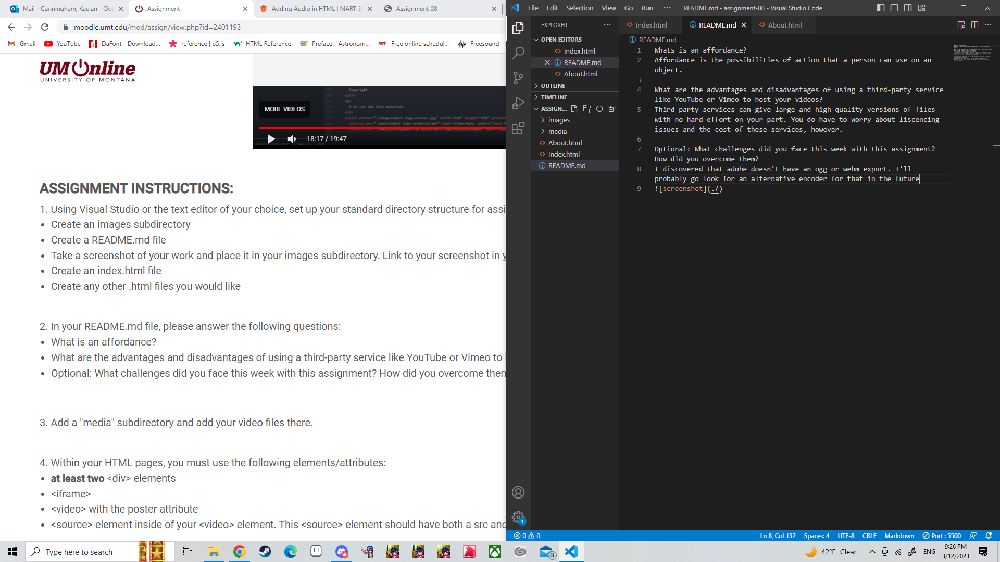

Whats is an affordance?
Affordance is the possibilities of action that a person can use on an object.

What are the advantages and disadvantages of using a third-party service like YouTube or Vimeo to host your videos?
Third-party services can give large and high-quality versions of files with no hard effort on your part. You do have to worry about liscencing issues and the cost of these services, however.

Optional: What challenges did you face this week with this assignment? How did you overcome them?
I discovered that adobe doesn't have an ogg or webm export. I'll probably go look for an alternative encoder for that in the future. Also a surprising amount of youtube videos did not allow themselves to be embedded in a website. 

