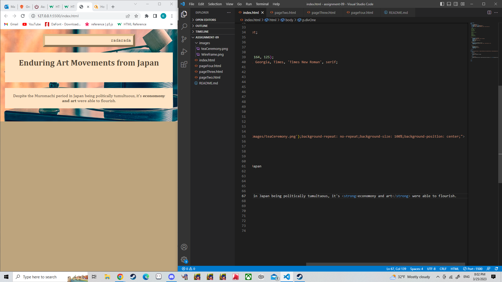

Briefly recap your experience learning HTML. What was old, new, interesting, or difficult to learn?

In creative coding, we did a lot of if/then statements, loops, etc. We didn't really dive deep into all you can do with just html, so finding ways to make pleasant design on a webpage is very new to me. It's fun to do. Creating exact visuals is much more complex than I expected, it takes a little patience. I feel like there is a big gap between doing basic designs and making anything more complex; I feel this especially when I look online for answers, if I want to make something be a specific way.

After we come back from spring break we will start to dive into CSS and expand on styling, which helps us "decorate" HTML. Is there anything you're anxious or excited to learn about in this new section?

I'm very excited to be able to spruce up webpages! I wonder if there is a simple and clean way to make background animations work in css.

