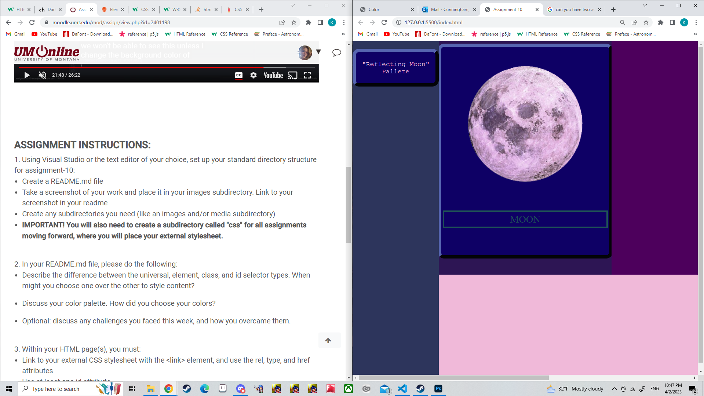

Describe the difference between the universal, element, class, and id selector types. When might you choose one over the other to style content?
"universal" selects ALL elements on a page, so it should be used when something should effect all elements. 

"Element" selects all of a certain type of element, so use when something should fact every instance of a certain element. 

"Class" selects any elements assigned a certain class attribute. It should be used when attributes will be used across more varied elements, so they all have some common attributes but aren't quite the same. 

"ID" selects a particular element. It should be used when there is a single element that should be effected.

Discuss your color palette. How did you choose your colors?
I looked at some pond pictures taken at night. There was one with pink reflections in the water that I thought were especially pretty. 

