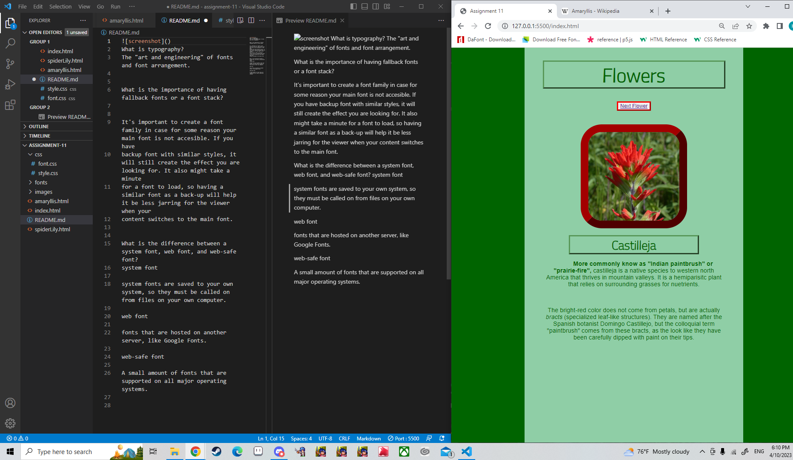

What is typography?
The "art and engineering" of fonts and font arrangement. 

What is the importance of having fallback fonts or a font stack?

It's important to create a font family in case for some reason your main font is not accesible. If you have 
backup font with similar styles, it will still create the effect you are looking for. It also might take a minute
for a font to load, so having a similar font as a back-up will help it be less jarring for the viewer when your
content switches to the main font. 

What is the difference between a system font, web font, and web-safe font?
system font

system fonts are saved to your own system, so they must be called on from files on your own computer. 

web font

fonts that are hosted on another server, like Google Fonts.

web-safe font

A small amount of fonts that are supported on all major operating systems. 

